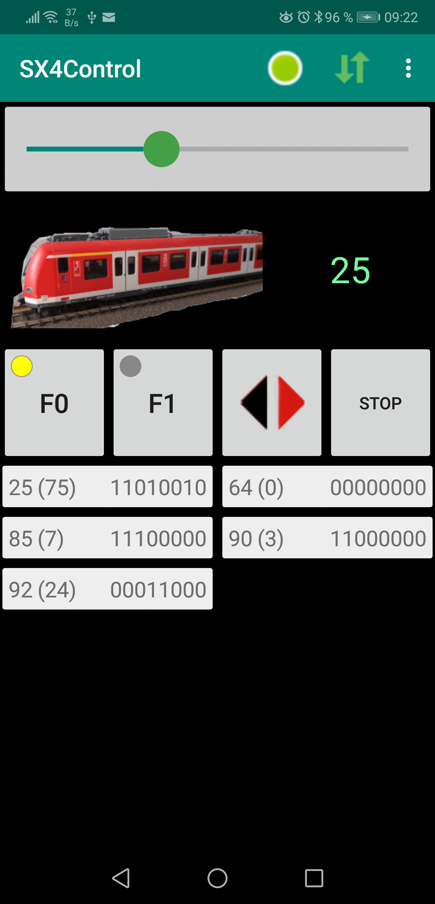
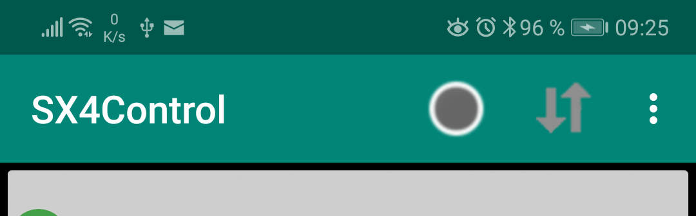
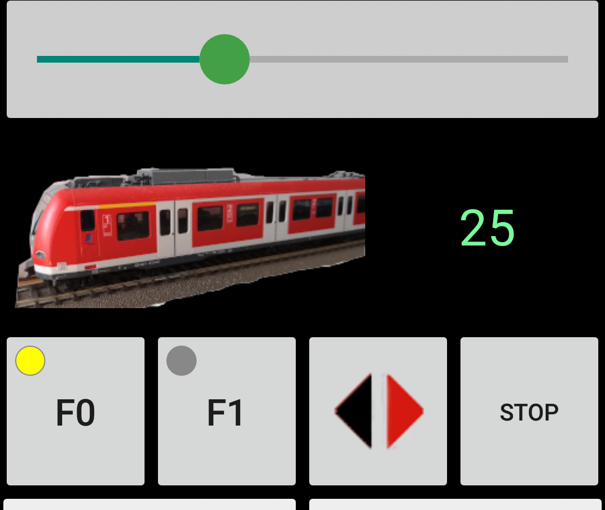
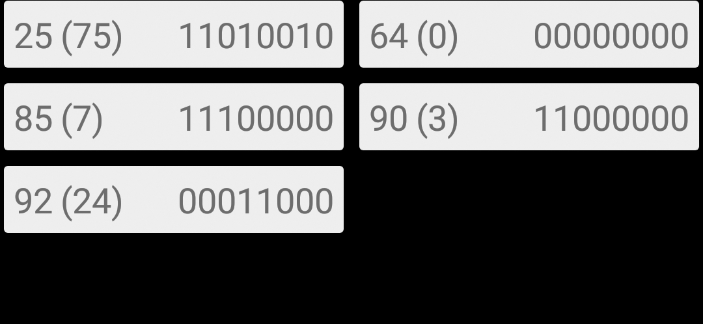
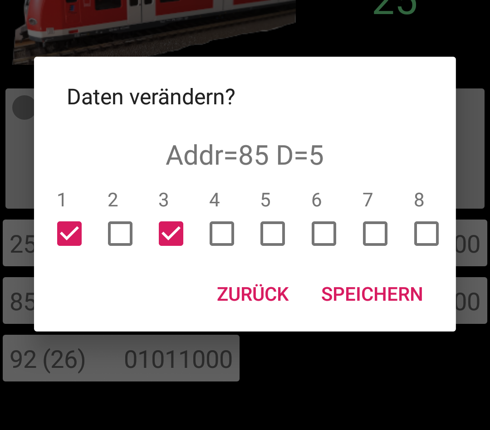

# SX4Control (Android)

Einfaches Android Programm zum Steuern von Loks und Weichen/Signalen über das SXnet. Die Zentrale der Anlage wird hierbei über das SX4 Programm per serieller Schnittstelle angesteuert, siehe [SX4 (PC)](https://opensx.net/sx4). Kompatible Zentralen sind im Moment SL850AD/SLX825 von Rautenhaus und die FCC von Döhler+Haas, die FCC jedoch nur im „SX1“ Modus.
  

## Bedienung

In den „Einstellungen“ des Programms muss man zunächst die IP-Adresse des SXnet(SX4)-Servers eingeben, zu dem sich das Android Programm verbinden soll. Bei korrekter Einstellung dieser Adresse und laufendem SX4-(PC)-Programm ist dann dieser Screen zu sehen:

Oben rechts wird mit den beiden grünen Pfeilen angezeigt, dass die Verbindung besteht, daneben zeigt ein roter oder grüner Punkt an, ob an der Zentrale die Gleisspannung eingeschaltet ist. Wenn in den Einstellungen die „Power-Kontrolle“ aktiviert wurde, so kann man durch Anklicken dieses Punkts die Spannung ein- und ausschalten.

Wenn die Verbindung verlorengeht, so sind die Pfeile ausgegraut – durch Klick auf die Pfeile kann ein „reconnect“ versucht werden.

## Loksteuerung

In der oberen Hälfte des Screens wird eine Lok gesteuert (Adresse wird in grün dargestellt) – Anklicken dieser Adresse lässt die Auswahl von weiteren Loks zu, dabei heisst „+“: eine neue Lokadresse auswählen, die bisher noch nicht in der Liste der Adressen ist.

## SX-Monitor

In der unteren Hälfte des Screens werden alle SX-Kanäle angezeigt, die einen von 0 verschiedenen Wert haben (weitere Kanäle können im App-Menu hinzugefügt werden zu dieser Ansicht). Ansicht jeweils: Kanel-Adresse, in Klammen Wert in Dezimal, und die 8 Werte der SX-bits in der üblichen Reihung von Bit1 bis Bit8.

Durch Auswahl eines Kanals öffnet sich ein „pop-up“ Fenster, in dem die 8 „SX-Bits“ einer Adresse verändert werden können.

## Website

Mehr zum gesamten "SX4"-Projekt unter:

[https://opensx.net/sx4](https://opensx.net/sx4)

## Source Code

Der Code liegt auf github unter 

[https://github.com/michael71/SX4Control](https://github.com/michael71/SX4Control)
    

## Licence

[GPL v3.0](https://www.gnu.org/licenses/gpl-3.0.en.html)
    
